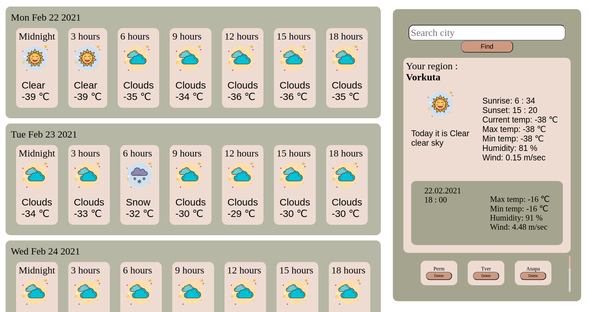

# Weather APP



## How to start
### Step 1

```
 git@github.com:mezentseva-anna/weatherAPI.git
```
### Step 2
```
 npm install
```
or
```
 yarn install
```
### Step 3
Create `.env.local` file out of `src` repo. 
Insert following :
```
REACT_APP_API_KEY=225abfa411f28e9fc932bb562723dca8
```
### Step 4
```
 npm start
```
or
```
 yarn start
 ```